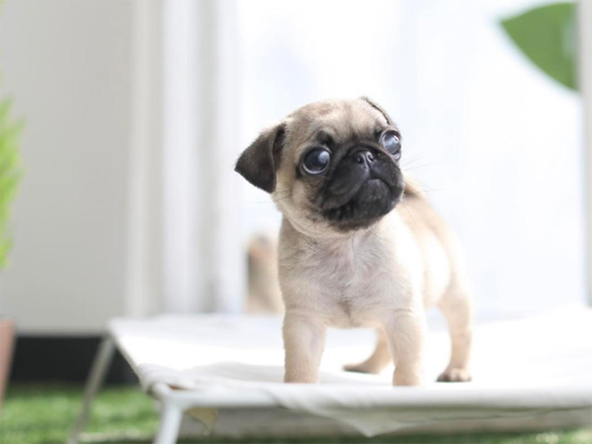

# Style-Transfer
An implementation of neural style transfer based off of <https://medium.com/tensorflow/neural-style-transfer-creating-art-with-deep-learning-using-tf-keras-and-eager-execution-7d541ac31398>
<pre>
Uses deep learning to compose images in the style of another image

Example:

CONTENT IMAGE:                                         STYLE IMAGE: </pre>
<pre>
</img>  </img> 
</pre>
<pre>                                             OUTPUT IMAGE:           </pre>
<pre>                      </img> </pre>
